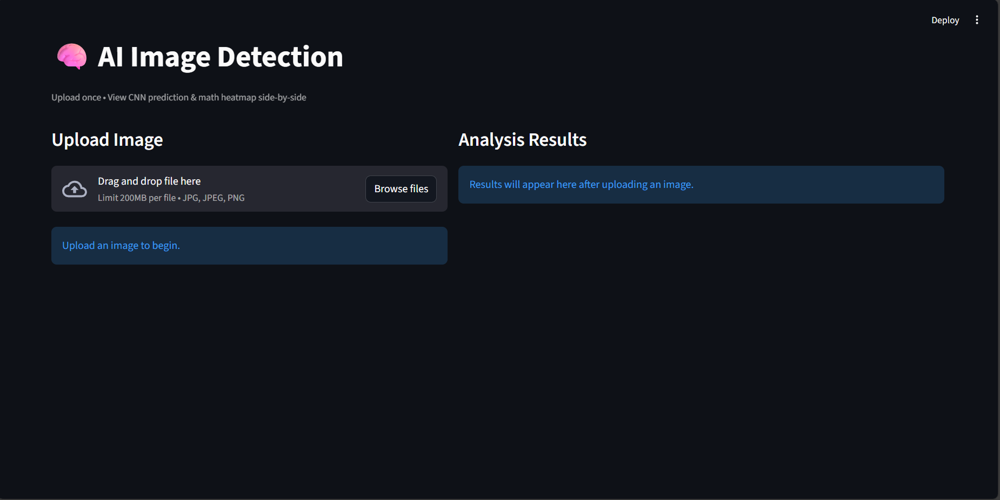
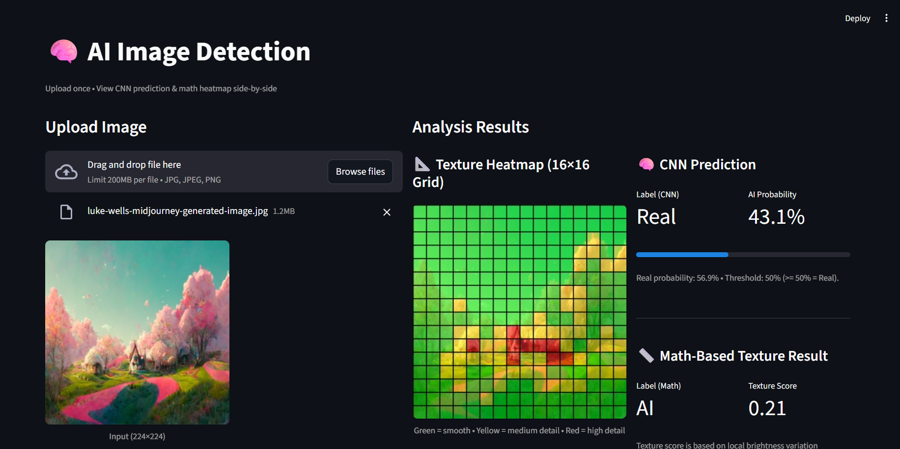
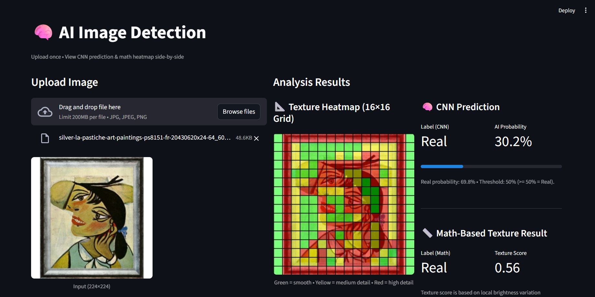

# 🧠 AI-Generated Image Detection (Streamlit App)

A clean and lightweight computer vision web application that detects whether an image is **AI-generated** or **Real** using a custom **CNN model** and an additional **Math-Based Texture Analysis** grid.  
Built with **TensorFlow/Keras**, **NumPy**, and **Streamlit**, trained locally, and deployed on **Streamlit Cloud**.

🔗 **Live App:**  
👉 https://ai-detector-akira.streamlit.app/

---

## 📦 Dataset

This project uses the **AI Generated Images vs Real Images** dataset from Kaggle:

**Dataset Source:**  
🔗 https://www.kaggle.com/datasets/cashbowman/ai-generated-images-vs-real-images

**Author:** Cash Bowman  
The dataset contains a mixed set of real photographs and AI-generated images, covering portraits, animals, scenery, and abstract content — suitable for binary classification.

---

## 🚀 Project Overview

This project demonstrates a complete end-to-end workflow for AI image detection:

### ✔ Data Pipeline
- Load & preprocess the Kaggle dataset  
- Normalize image sizes to **224×224 RGB**  
- Apply augmentation (flip, zoom, rotation)  
- Automatic 80/20 **train–validation split**  
- Prepare clean binary labels (AI / Real)

### ✔ App Pipeline
- User uploads an image  
- App runs **two detectors**:
  1. **CNN classifier** (learned features)
  2. **Math texture detector** using 16×16 grid (explainable heuristic)
- Heatmap overlay shows texture intensity (Green → Red)
- Final prediction, probabilities, and confidence bar displayed

---

## 🤖 Models Used

The project includes **two detection systems**:

### 1️⃣ CNN Model (TensorFlow/Keras)
A simple CNN architecture:

| Layer                     | Details                         |
|--------------------------|---------------------------------|
| Conv2D + ReLU            | Feature extraction block 1      |
| MaxPooling2D             | Reduce spatial dimensions       |
| Conv2D + ReLU            | Feature extraction block 2      |
| MaxPooling2D             | Reduce spatial dimensions       |
| Conv2D + ReLU            | Last conv layer                 |
| MaxPooling2D             | Reduce spatial dimensions       |
| Flatten                  | Convert to vector               |
| Dense (64) + Dropout     | Hidden layer                    |
| Dense (1, sigmoid)       | Binary output (AI vs Real)      |

---

### 2️⃣ Math-Based Texture Analysis (Explainable Method)

This method does **not** use machine learning, it relies purely on image statistics to estimate how “natural” the texture of an image is.

**How it works:**

- Convert the image to **grayscale**
- Split the image into a **16 × 16 grid** (256 blocks)
- For each block:
  - Compute the **local texture level** using standard deviation  
  - Low std = smooth surface  
  - High std = detailed/natural texture
- Normalize all texture values into a **0–1 range**
- Assign each block a color based on its texture level:
  - 🟩 **Green** → very smooth (often seen in AI-generated images)  
  - 🟨 **Yellow** → moderate texture  
  - 🟥 **Red** → strong texture (commonly seen in real photos)

The result is a fully transparent, interpretable **texture heatmap**.  
It helps show *where* the image has natural details, something AI images typically struggle with.

---

## 📊 Model Performance (CNN)

Training a lightweight CNN for 5 epochs gives:

| Epoch | Train Accuracy | Val Accuracy | Val Loss |
| ----- | -------------- | ------------ | -------- |
| 1     | ~0.57          | ~0.55        | ~0.65    |
| 2     | ~0.62          | ~0.58        | ~0.68    |
| 3     | ~0.61          | ~0.68        | ~0.63    |
| 4     | ~0.70          | ~0.64        | ~0.62    |
| 5     | **~0.77**      | **~0.66**    | ~0.70    |

> ⭐ The simple CNN reaches **~77% training accuracy** and **~66% validation accuracy**.  
> Can be further improved by switching to **ResNet/EfficientNet**.

---

## 🖥️ Streamlit Interface Screenshots

Below are sample image placeholders (replace with your own):

### 🔹 Example 1  

### 🔹 Example 2  

### 🔹 Example 3  

